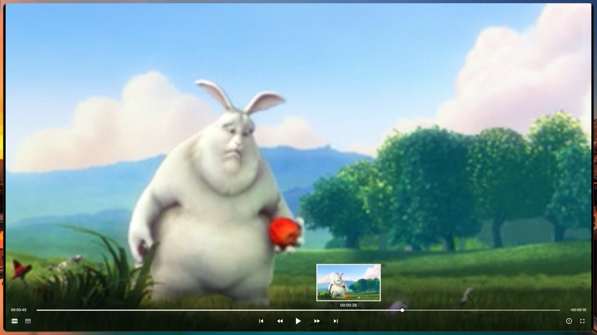

# MinMPV


Minimal MPV config with sane Scripts and shortcuts.

## Features

- Minimal and modern OSC/OSD interface using theme from
  [mpv-settings-mac](https://github.com/xiaoleichen/mpv-settings-mac).
- Automatically add all media files from current folder to playlist.
- Save position for all plays by default.
- Sane screenshot settings.
- Sane Cache settings.
- `gpu-hq` profile by default.
- Gallery view to see all media files in current directory.
- Mouse gestures for volume and seeking.

## Installation

- backup current mpv directory under `~/.config/mpv`

```bash

mv ~/.config/mpv ~/.config/mpv.bak

```

- clone repository into `~/.config/mpv`.

```bash
git clone https://github.com/Blacksuan19/MinMPV ~/.config/mpv
```

## Scripts

| Script                                                                                   | Function                                                           | Shortcut                        |
| ---------------------------------------------------------------------------------------- | ------------------------------------------------------------------ | ------------------------------- |
| [thumbfast](https://github.com/po5/thumbfast)                                            | generate thumbnails when hovering over the seekbar.                |
| [autoload](https://github.com/noelsimbolon/mpv-config/blob/windows/scripts/autoload.lua) | automatically load playlist entries before and after current file. |
| [osc-modern](https://github.com/Blacksuan19/mpv-conf/blob/master/scripts/osc_modern.lua) | Minimal OSC theme.                                                 |
| [dynamic-crop](https://github.com/Ashyni/mpv-scripts#dynamic-croplua)                    | dynamically remove black borders around video.                     | <kbd>Shift</kbd> + <kbd>C</kbd> |
| [mpv-gallery-view](https://github.com/occivink/mpv-gallery-view)                         | gallery view of files in current folder with thumbnails            | <kbd>g</kbd>                    |

## Mouse gestures

- swipe right to seek forward
- swipe left to seek backward
- swipe up to down to lower volume
- swipe down to up to increase volume

## Showcase

### Video Gallery


### OSD


### Thumbnails


